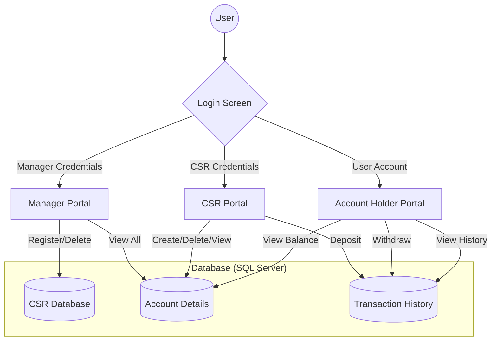

# 🏦 Bank Management System

[](https://www.oracle.com/java/)
[](https://en.wikipedia.org/wiki/Swing_(Java))
[](https://www.microsoft.com/en-us/sql-server/)

A sophisticated desktop application built for streamlined banking operations. This system provides a robust interface for three distinct user roles: **Managers**, **Customer Service Representatives (CSRs)**, and **Account Holders**, ensuring secure and efficient financial management.

---

## 📽️ Project Demonstration

You can find a full walkthrough of the application in action here:
[Project Video.mp4](./FA23-BCS-054%20+%20FA23-BCS-058%20_Bank%20Management%20System_/Semester%20Project/Final%20Project/Project%20Video.mp4)

---

## ✨ Key Features

### 👑 Manager Portal
*   **CSR Governance**: Full control to register and onboard new Customer Service Representatives or remove them from the system.
*   **Total Oversight**: Access a comprehensive dashboard viewing all registered account holders, their personal details, and real-time balances.

### 🎧 Customer Service Representative (CSR)
*   **Account Life-cycle**: Seamlessly create new bank accounts (Supporting both **Saving** and **Current** types) and manage account closures.
*   **Member Intelligence**: Advanced lookup tools to retrieve detailed profiles of account holders.
*   **Financial Input**: Process over-the-counter cash deposits for customers.

### 👤 Account Holder Portal
*   **Secure Transactions**: Perform self-service fund withdrawals with automated balance integrity checks.
*   **Interactive Balance Inquiry**: A unique "Sneak-Peek" hover feature that reveals the current balance only when intended.
*   **Financial Transparency**: Access a detailed transaction ledger showing history, amounts, and dates/times.

---

## 🏗️ System Architecture



---

## 🛠️ Technology Stack

*   **Language**: Java (Object-Oriented Architecture)
*   **UI Framework**: Java Swing & AWT for a responsive desktop experience.
*   **Database**: Microsoft SQL Server for secure and persistent storage.
*   **Connectivity**: JDBC (Java Database Connectivity) for high-performance DB interaction.
*   **Libraries**: `JDateChooser` for user-friendly date selections.

---

## 📂 Project Structure

```text
├── Code/                      # Java Source Files
│   ├── Models/                # Data structures (Person, AccountHolder, Transaction)
│   ├── Controllers/           # Logic handlers (Manager, CSR, AccountHolder)
│   └── GUI/                   # Swing Frame implementations
├── Database Tables/           # Schema visual representations
├── Project Report.pdf         # Technical documentation & Design analysis
└── Project Video.mp4          # Live demonstration
```

---

## 🚀 Setup & Installation

### 1. Prerequisites
*   **JDK 8 or higher**
*   **Microsoft SQL Server**
*   **SQL Server JDBC Driver** (`mssql-jdbc`)

### 2. Database Initialization
1.  Create a new database in SQL Server named `BankManagementSystem`.
2.  Execute the table creation scripts (refer to schemas in `Database Tables/`).
3.  Configure your SQL Server instance to allow **Mixed Mode Authentication**.

### 3. Application Configuration
1.  Navigate to `ConnectionProvider.java`.
2.  Update the URL with your local server details:
    ```java
    String url = "jdbc:sqlserver://localhost:1433;databaseName=BankManagementSystem;user=YOUR_USER;password=YOUR_PASS;";
    ```

### 4. Running the App
1.  Open the project in your preferred IDE (VS Code, IntelliJ, or NetBeans).
2.  Add the JDBC driver to your project libraries.
3.  Run `LoginScreen.java` to start the application.

---


